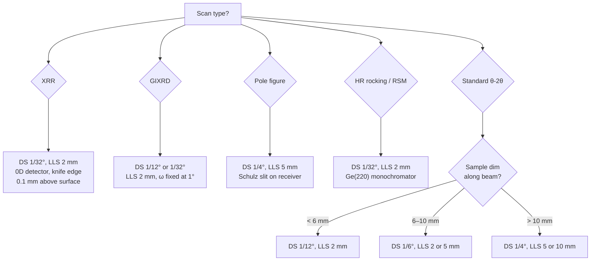
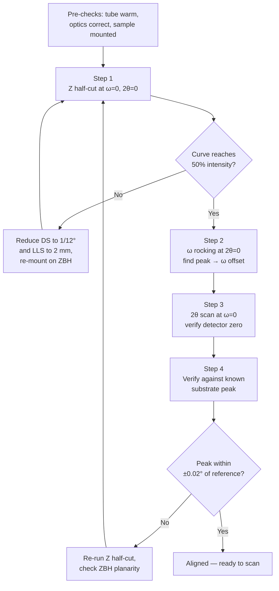

# X-Ray Diffraction

## Overview

XRD measures the angular distribution of elastically scattered X-rays from a crystalline sample. For thin films on metallic or single-crystal substrates, it answers four practical questions: **what phases are present**, **how oriented are they** (texture, epitaxy), **how strained are they** (peak position vs reference, sin²ψ), and **how big are the coherent crystallites** (Scherrer broadening, Williamson–Hall).

At FSU/ASC the instrument is a **Rigaku SmartLab** with a **χ–φ cradle (in-plane / pole-figure attachment)**. The tube is Cu Kα (λ = 1.5406 Å for Kα₁, 1.5444 Å for Kα₂; 0.5 weight ratio when no monochromator is used). Optical configuration is reconfigurable Bragg–Brentano (BB) ↔ parallel-beam (PB) via the CBO mirror; this page assumes parallel-beam unless noted, because **PB is the correct mode for thin films, small samples, and any scan with χ ≠ 0**.

This page is the working reference for thin-film XRD on the SmartLab. It covers geometry, slit selection, mounting, alignment, the five scan types we actually run, and the analysis chain for each. It is intentionally long because the questions a new user asks ("which slit?", "why is my peak shifted?", "is this Kβ or a real peak?") all collapse into geometry once you have the framework.

---

## Geometry Fundamentals

### Coordinate system on the SmartLab

| Axis | Motion | What it controls |
|------|--------|------------------|
| ω (theta_s) | Sample tilt about goniometer axis | Incidence angle of X-ray beam onto sample surface |
| 2θ (theta_d) | Detector arm | Diffraction angle to detector |
| χ | Sample tilt out of diffraction plane | Off-axis tilt for pole figures, in-plane scans, residual stress |
| φ | Sample rotation about surface normal | In-plane orientation; pole figure azimuth |
| Z | Sample height | Sets sample surface to goniometer rotation axis |
| X, Y | Sample translation in surface plane | Centers sample under beam |

For a θ-2θ scan, ω = θ; for grazing-incidence (GIXRD), ω is fixed (small) while 2θ alone scans. The χ–φ cradle is what enables texture, in-plane diffraction, and the residual-stress sin²ψ method on this instrument.

### The two beam dimensions you must track

X-ray spot at the sample is characterized by **two independent dimensions**:

1. **In-plane width** (in the diffraction plane) — set by the **divergence slit (DS)** and the source-to-sample distance. This determines the **footprint along the beam direction** when projected onto a tilted sample.
2. **Axial length** (perpendicular to the diffraction plane, along the goniometer axis) — set by the **length-limiting slit (LLS)** and Soller slits. This determines the **width of the beam along the goniometer axis**.

For a sample lying flat under the beam, the footprint is:
```
Footprint length along beam   = (beam height in diffraction plane) / sin(ω)
Footprint width across beam   = LLS opening (within ~5% for parallel beam; broader for BB)
```

The footprint length grows as 1/sin(ω). At ω = 5° the footprint is roughly 11× the beam height; at ω = 1° it is 57×. This is why **footprint overshoot is the dominant geometry problem at low angles**, and why GIXRD and XRR demand both a small DS *and* a beam-knife or footprint correction.

### Beam height vs. divergence slit (Cu Kα, 300 mm source-to-sample, parallel beam)

| DS opening | Beam height at sample | Notes |
|------------|----------------------|-------|
| 1/32° (0.03°) | ≈ 0.16 mm | High-resolution rocking, RSM |
| 1/12° (0.08°) | ≈ 0.42 mm | Default for thin films, GIXRD |
| 1/6° (0.17°) | ≈ 0.87 mm | General θ-2θ on small samples |
| 1/4° (0.25°) | ≈ 1.3 mm | General θ-2θ, larger samples |
| 2/3° (0.67°) | ≈ 3.5 mm | High-throughput powder; rarely correct for films |
| 1° (1.0°) | ≈ 5.2 mm | Powder only |

For BB geometry these scale ~1.4× larger because the beam is divergent rather than parallel; treat the table as a parallel-beam reference.

### Length-limiting slits (LLS) on SmartLab

LLS is on the **incident side after the CBO mirror**. It cuts the beam in the **axial direction** (perpendicular to the diffraction plane). Available: **10, 5, 2 mm**. Rule:

> Choose the largest LLS whose opening is still **smaller than the sample's axial dimension** so the beam width is fully contained.

For a 3.5 mm × 8 mm sample with the 8 mm side oriented along the beam: axial dimension = 3.5 mm → use **2 mm LLS**. The 5 mm LLS would spill light past the 3.5 mm edge into the holder, contaminating the pattern with holder/putty scattering.

### Schulz slit

The Schulz slit is a **defocusing (anti-divergence) slit on the receiving side**, used to keep the receiver acceptance approximately constant as χ tilts during pole figure measurement. **Do not use it for θ-2θ, rocking curves, or RSM.** Install it only when running a pole figure (χ scan from 0° to 80° at constant 2θ).

### Worked example — 3.5 × 8 × 1 mm thin-film coupon

This is the canonical "small sample" case. Orient the **8 mm dimension along the X-ray beam** and the 3.5 mm dimension along the goniometer axis.

Side-view geometry of the incident beam hitting the sample:

```
                  ╲      ╲
                   ╲      ╲   ← incident X-ray beam
                    ╲      ╲      parallel rays, height h
                     ╲      ╲
                      ╲  ω   ╲
     ─────────────────●───────●──────────────  sample surface
                      └───L───┘
                   footprint  L = h / sin(ω)
```

You need L < 8 mm everywhere in your scan range. Footprint table for this sample (h = DS × ~300 mm):

| ω (°) | DS = 1/32°<br>(h = 0.16 mm) | DS = 1/12°<br>(h = 0.42 mm) | DS = 1/6°<br>(h = 0.87 mm) | DS = 1/4°<br>(h = 1.31 mm) |
|-------|------|------|------|------|
| 1° | 9.2 mm ✗ | 24 mm ✗ | 50 mm ✗ | 75 mm ✗ |
| 3° | 3.1 mm ✓ | 8.0 mm ✗ | 17 mm ✗ | 25 mm ✗ |
| 5° | 1.8 mm ✓ | 4.8 mm ✓ | 10 mm ✗ | 15 mm ✗ |
| 10° | 0.92 mm ✓ | 2.4 mm ✓ | 5.0 mm ✓ | 7.5 mm ✓ |
| 20° | 0.47 mm ✓ | 1.2 mm ✓ | 2.5 mm ✓ | 3.8 mm ✓ |
| 40° | 0.25 mm ✓ | 0.65 mm ✓ | 1.4 mm ✓ | 2.0 mm ✓ |

A θ-2θ scan from 2θ = 20° → 80° corresponds to ω = 10° → 40°. At ω = 10° (worst case in that range): 1/4° gives 7.5 mm — too close to the 8 mm edge for safety; 1/6° gives 5.0 mm — adequate; **1/12° gives 2.4 mm — comfortable margin**, and HyPix-3000 throughput more than compensates for lost flux.

GIXRD at ω = 1° exceeds the sample with every DS — at grazing incidence the spillover is unavoidable; mask it instead with a **knife edge** above the surface.

**Axial direction (3.5 mm dimension):** the LLS sets this. 2 mm LLS leaves 0.75 mm margin on each side — use it.

### Slit-selection decision tree



---

## Sample Mounting

### The mounting hierarchy (best to worst for thin films)

1. **Si zero-background plate (ZBH), single crystal off-cut** — preferred for any film smaller than ~10 mm. The (510)-cut wafer produces no diffraction in the Cu Kα window. Mount the sample on the polished face with a thin smear of vacuum grease or a single small dab of putty under one corner. Surface of the film must be coplanar with the ZBH reference surface; if the film sample is 1 mm thick, use a recessed ZBH or accept a Z offset that you re-align out.
2. **Si single-crystal wafer (any orientation)** — acceptable substitute for ZBH. May produce a single sharp substrate peak (e.g., Si(004) at 2θ ≈ 69.13°); flag and exclude it from analysis.
3. **Glass slide** — only for thick films where amorphous halo (2θ ≈ 20–30°) does not overlap the peak of interest. Avoid for low-2θ work.
4. **Standard SmartLab Al holder, sample sunk into recess with putty** — works for 8×8 mm coupons that fill the recess. **Bad for 3.5 × 8 mm and smaller** — the surrounding putty/Al diffracts and the half-cut alignment finds the wrong surface.
5. **Magnetic puck (for χ–φ cradle)** — use the small steel disc + magnetic chuck path. Place the sample on a clean ZBH first, then magnet the ZBH to the puck.

### Mounting small samples (3.5 × 8 × 1 mm or smaller)

This is the case that breaks naive setups. The procedure:

1. Wipe a Si ZBH plate with IPA, dry with clean N₂.
2. Dot a single ~1 mm putty bead at the *center* of the ZBH (not under the sample edges — putty under the edge tilts the sample; putty near the center allows the rigid substrate base to set the plane).
3. Place sample face-up, **long axis (8 mm) aligned along the X-ray beam direction** (use the dial/markings on the φ stage). Press gently with a clean tweezer until the sample surface is coplanar with the ZBH reference surface (check by sighting along the surface).
4. Center the sample over the ZBH datum mark by eye or with the optical alignment camera if your SmartLab is so equipped.
5. Mount the ZBH on the χ–φ stage. Do not use the standard recessed Al holder for samples under ~6 mm.

### Why orientation matters

Footprint length grows as 1/sin(ω) along the beam direction. Putting the **8 mm dimension along the beam** gives you the most tolerance for low-ω scans. The 3.5 mm dimension is then perpendicular to the beam (along the goniometer axis), where the LLS controls beam width — a 2 mm LLS leaves 0.75 mm of margin on each side.

### Field-expedient mounting — Si wafer + double-sided tape

For when no ZBH is available. Workable, with three caveats and one tweak.

**Stack (bottom to top):**

```
   sample (long axis along X-ray beam)
   └─ small putty dot at center (smaller than sample footprint)
   ├─── Si wafer (~15 × 15 mm, larger than sample, polished side up)
   ├─── double-sided tape (smaller than Si — hides under the wafer)
   └─── Al sample plate (SmartLab standard)
```

**Caveats:**

1. **Standard Si(100) is not zero-background.** It produces a single sharp peak at **2θ ≈ 69.13° (Si(004), Cu Kα)**. For Nb3Sn this falls cleanly between A15 (321) at 65.3° and (400) at 73.7° — flag and exclude. A true ZBH (Si (510) or (911) cut, ~$30–50 from MTI Corp) eliminates it.
2. **Double-sided tape creeps** over hours-long scans → peak drift in 2θ. Negligible for 30-min phase ID; real for XRR or pole figures. Test by re-running a peak after one hour and checking for shift.
3. **Tape thickness (~50–100 µm) lifts the sample surface.** Always re-run Z half-cut alignment after mounting; never trust a stored Z₀.

**Tweak:** keep tape **only between Si wafer and Al plate**. Under the sample on top, use a **single small dot of putty**, not tape — putty deforms once and stops; tape keeps creeping. The 1 mm Cu substrate is opaque to Cu Kα (penetration ~20 µm), so the layer below the sample never diffracts; the issue is purely mechanical drift, and putty wins on that.

If only tape is available, shorten scans and re-align Z between runs.

### Sample displacement error — why "lift it higher" is the wrong instinct

If the sample surface sits at height **s** above the goniometer rotation axis, every peak shifts:
```
Δ(2θ) ≈ −(2 s cos θ) / R     [R = goniometer radius, ~300 mm on SmartLab]
```
For s = 100 µm at θ = 20° (2θ = 40°), Δ(2θ) ≈ −0.036° — easily enough to misindex a peak or misread a strain. **Always align Z to the actual surface** rather than relying on a nominal mount. Lifting the sample physically only matters if (a) it gets the surface coplanar with the ZBH reference, or (b) it lifts the film off contaminated holder material — and in both cases you must run Z alignment afterward.

---

## Alignment Procedure (Rigaku SmartLab)

The SmartLab software offers **automatic alignment** (Z half-cut → ω rocking → θ-2θ offset). For thin films and small samples, **always verify each step manually** because the auto-routine occasionally locks onto the wrong surface or a Kβ peak.




### Step 0 — Pre-checks

- [ ] Tube warmed up at 40 kV / 30 mA for ≥30 min before alignment.
- [ ] Optical configuration matches intended scans (PB for thin films; BB for powder).
- [ ] DS, LLS, RS slits installed and recorded in the recipe.
- [ ] Sample mounted, holder seated, doors closed and interlocked.

### Step 1 — Z half-cut (sample-surface alignment)

Goal: bring the sample surface to the goniometer rotation axis (Z = 0).

1. Set ω = 0°, 2θ = 0°. Insert attenuator (auto on SmartLab).
2. Drive Z down 0.5–1 mm below the expected zero so the sample is fully out of the beam.
3. Scan Z upward while logging direct-beam intensity at the detector.
4. Identify the curve: full intensity at low Z (beam clears sample) → drops to zero as sample blocks the beam → half-intensity Z position is **Z = 0**.
5. **Failure mode for small samples:** if the curve plateaus before reaching half intensity, your sample is smaller than the beam projection. Reduce DS or LLS and rerun; or do a **2-point half-cut** with the sample re-centered.
6. Repeat at ω = 0.2° and 0.5° — Z₀ should not drift more than 5 µm. If it does, the sample is tilted; re-mount.

### Step 2 — ω rocking (surface-to-beam parallelism)

Goal: bring the sample surface parallel to the X-ray beam at ω = 0°.

1. With Z at the half-cut position, scan ω from −0.5° to +0.5° at 2θ = 0°.
2. Locate the peak of the direct-beam-through-sample-edge profile. ω at the peak is the **ω offset**.
3. Apply offset: software either adjusts a virtual offset or you re-zero ω physically.

### Step 3 — 2θ offset (detector zero check)

Goal: confirm the detector is centered on the direct beam at 2θ = 0°.

1. With Z and ω aligned, scan 2θ from −0.5° to +0.5° at ω = 0.
2. Peak should be at 2θ = 0° within 0.005°. If not, re-zero or apply offset in the recipe.

### Step 4 — Substrate-peak verification (the trust-but-verify step)

For Cu, Nb, Si, Al₂O₃ substrates: scan a narrow 2θ window over a known substrate peak with ω = 2θ/2 and confirm the peak lands at the reference 2θ ± 0.02°. Catches any uncorrected sample displacement.

| Substrate | Reflection | 2θ (Cu Kα₁) |
|-----------|------------|-------------|
| Cu | (111) | 43.30° |
| Cu | (200) | 50.43° |
| Nb | (110) | 38.50° |
| Si | (004) (forbidden) — use (111) at off-axis | 28.44° (111) |
| α-Al₂O₃ (sapphire c-cut) | (0006) | 41.68° |

### When automatic alignment fails

- **"Half-cut intensity never drops to half"** → beam is wider than sample. Reduce DS to 1/12° or smaller; reduce LLS to 2 mm; re-run.
- **"Z keeps drifting between scans"** → putty under sample creep. Re-mount on ZBH with stiff putty or grease and zero strain.
- **"ω rocking peak is double-humped"** → sample bowed, bicrystal, or Kα₁/Kα₂ split visible. For thin films this is real; pick the Kα₁ peak.

---

## Slit Selection Guide

### Incident side

| Configuration | DS | LLS | Soller (axial div.) | Use |
|---------------|-----|-----|---------------------|-----|
| Small thin film, θ-2θ | 1/12° or 1/6° | 2 mm | 5° | Default for films <10 mm |
| Large thin film, θ-2θ | 1/4° | 5 or 10 mm | 5° | Films >10 mm |
| GIXRD (ω fixed) | 1/12° or 1/32° | 2 mm | 5° | Phase ID with strong substrate suppression |
| XRR (specular reflectivity) | 1/32° | 2 mm | 2.5° | Thickness, density, roughness |
| Rocking curve (HR) | 1/32° + Ge(220) monochromator | 2 mm | 2.5° | Mosaic, epitaxial quality |
| Pole figure | 1/4° | 5 mm | 5° + Schulz on receiver | Texture, χ scan |
| RSM (reciprocal space map) | 1/32° + Ge(220) | 2 mm | 2.5° | In-plane lattice parameter, strain state |

### Receiving side

- **Anti-scatter slit (AS or RS1):** 1° default; 0.5° for low-noise thin film. Cuts air scatter and stray light.
- **Receiving slit (RS2):** 0.3 mm or 0.5 mm for θ-2θ. Smaller slit → narrower instrumental peak but lower count rate.
- **Analyzer crystal (Ge(220) or Ge(440)):** for HR rocking curves and RSM; replaces RS2.
- **PSA (parallel-slit analyzer, ~0.5° or 0.114°):** for parallel-beam mode; preserves angular resolution without crystal optics.
- **Detector:** **HyPix-3000** in 1D mode for θ-2θ (~50× speed-up over 0D); 0D for HR and XRR.

### Receiving-slit caution

In parallel-beam mode the **PSA is the receiver — do not also insert a small RS2** unless you specifically want to over-collimate. Stacking optics drops counts without improving resolution.

---

## Scan Types

### 1. θ-2θ scan (Bragg–Brentano or parallel-beam) — phase identification

Sample at ω = θ; detector at 2θ; both move together. Diffraction vector remains parallel to surface normal — only out-of-plane planes contribute.

**Range:** 20–80° for Nb, Nb3Sn, Cu, A15 phases. Extend to 100° for residual-stress sin²ψ.
**Step size:** 0.02° standard; 0.01° for narrow peaks; 0.05° for survey.
**Speed:** 1–5°/min on HyPix 1D for survey; 0.1–0.5°/min for quantitative profile fitting.
**Output:** Intensity vs 2θ. Index against ICDD PDF cards or Crystallography Open Database (COD) entries.

**Thin-film gotcha:** a 1 µm film on a 1 mm substrate gives ~1000× more intensity from the substrate than the film at most angles. Substrate peaks **will dominate**. Use parallel beam + small ω-fixed offset (GIXRD) to suppress substrate, *or* match film peaks by 2θ position even when they sit on the shoulder of a substrate peak.

### 2. Grazing-incidence XRD (GIXRD) — film phase ID with substrate suppression

Fix ω at a small angle (typically 0.5–3°) above the critical angle for total external reflection (~0.4° for most metals). Scan 2θ alone. The diffraction vector tilts off the surface normal; depth probed scales with ω.

**Why use it:** at ω = 1°, X-ray penetration into Nb is only ~150 nm — most of the Nb signal comes from the film, not the substrate. **The single best technique for phase ID in films <500 nm.**
**Cost:** peaks are broader (instrumental + tilt convolution), peak positions are slightly shifted from θ-2θ values, intensities do not match PDF cards.
**Recipe:** ω = 1°, 2θ = 20–80°, 0.02°/step, parallel-beam optics, 1/12° DS, 2 mm LLS, PSA on receiver.

### 3. Rocking curve (ω scan) — epitaxial quality

Fix 2θ at a film peak; scan ω across the peak (typically ±2° for textured films, ±0.5° for epitaxial). FWHM of the rocking curve is the **mosaic spread**.

**Typical values:** epitaxial NbN/MgO ~0.05–0.5°; sputtered Nb on c-Al₂O₃ ~1–3°; columnar polycrystalline films often 5–15°.
**Use:** verify epitaxy, track mosaic vs deposition condition, separate "good textured" from "random polycrystalline".

### 4. X-ray reflectivity (XRR) — thickness, density, roughness

ω = 2θ/2 around the **specular** condition, scanning 2θ from 0° to ~6°. Below the critical angle (~0.4° in 2θ for Nb): total reflection. Above: oscillating "Kiessig fringes" whose period gives film thickness, whose envelope decay gives roughness, and whose absolute intensity gives density.

**Recipe:** 1/32° DS, 2 mm LLS, 0D detector or HyPix in 0D mode, 0.005°/step, beam-knife installed on receiver side ~0.1 mm above sample surface to mask direct beam.
**Range:** 0–6° in 2θ for Nb-class films; 0–8° for lower-density films.
**Analysis:** Fit with GenX, RefNX, or Rigaku GlobalFit. Returns thickness (Å precision), electron density (→ stoichiometry cross-check), and rms roughness (Å).
**Gotcha:** films with surface oxide give a bilayer fit; do not over-interpret a single-layer model.

### 5. Pole figure — texture and orientation distribution

Fix 2θ at a chosen reflection. Scan χ from 0° to 80° in 5° steps; at each χ, scan φ from 0° to 360° in 5° steps. Result is a stereographic projection of the pole density.

**Recipe:** 1/4° DS, 5 mm LLS, **Schulz slit on receiver**, parallel-beam optics. Total measurement time ~2–4 hours per pole figure.
**Use:** identify fiber texture (e.g., (110) Nb grown on Cu shows a (110) ring concentrated at χ = 0°), epitaxial relationships (sharp poles), or random orientation (uniform intensity).
**Combine with φ scans at fixed χ ≠ 0** for in-plane epitaxial verification ("the φ scan shows 6-fold peaks → 6-fold in-plane texture").

### 6. Reciprocal space map (RSM) — in-plane lattice parameter and strain

2D map of intensity in (Qx, Qz) space, built by stepping ω at each 2θ in a coupled loop. Separates **in-plane** and **out-of-plane** lattice parameters of an epitaxial film. The film and substrate appear as separate spots; the line connecting them indicates whether the film is fully strained (vertical line under substrate spot) or fully relaxed (along the diagonal to its natural-lattice position).

**Recipe:** Ge(220) monochromator + analyzer crystal (HR mode). Pick an asymmetric reflection accessible for both film and substrate (e.g., (224) for cubic-on-cubic).
**Use:** measure in-plane and out-of-plane lattice parameters → extract biaxial strain ε∥ and ε⊥ → cross-check CTE strain predictions and Hc1/Bc2 modeling.

---

## Data Analysis Chain for Thin Films

### Phase identification

1. Convert raw .ras / .rasx file to ASCII or load directly in Rigaku PDXL.
2. Strip Kα₂ (Rachinger algorithm or PDXL built-in) **only if** you intend to compare peak positions to high-resolution references. For phase ID of thick or polycrystalline films, leave Kα₂ in.
3. Match against ICDD PDF cards. For Nb3Sn A15 phase use **PDF 00-019-0875**; for Nb (bcc) **PDF 00-035-0789**; for Cu (fcc) **PDF 00-004-0836**.
4. Flag undesired phases: Nb6Sn5 (low-Tc), NbSn2 (non-superconducting), Nb2O5, CuO/Cu2O, A2 (Sn-poor disordered Nb-Sn).

### Lattice parameter

For cubic Nb3Sn (space group Pm-3n):
```
a = λ √(h² + k² + l²) / (2 sin θ)
```
Use the highest-2θ peak available (smaller error in a from a given Δ(2θ)). FSU bulk Nb3Sn target: a ≈ 5.290 Å. Hot-bronze films on Cu typically show a = 5.275 ± 0.005 Å (compressed by CTE strain).

### Crystallite size — Scherrer

```
D = K λ / (β cos θ)        K ≈ 0.9 (spherical crystallites)
```
β must be in **radians** and must be the **structural broadening** = √(β_obs² − β_inst²), where β_inst is the instrumental width measured on a strain-free standard (LaB6 or Si SRM 640f). Scherrer is reliable up to ~100 nm; beyond that peak width is dominated by instrument and you cannot extract size.

### Crystallite size + strain — Williamson–Hall

```
β cos θ = K λ / D + 4 ε sin θ
```
Plot β cos θ vs sin θ for ≥4 reflections; intercept gives D, slope gives microstrain ε. Distinguishes "broad because small" from "broad because strained".

### Residual stress — sin²ψ method

For a chosen reflection, measure d-spacing as a function of ψ (tilt out of diffraction plane via χ). Plot d vs sin²ψ; slope is proportional to in-plane stress σ:
```
σ = E / (1+ν) × [slope / d₀]
```
For Nb3Sn (E ≈ 165 GPa, ν ≈ 0.3) on Cu, the FSU hot-bronze recipe shows in-plane compressive stress consistent with the −1.24% CTE strain reported in [[Withanage2021-Hot-bronze-Nb3Sn-on-Cu]].

### Texture coefficient

For a polycrystalline film:
```
TC(hkl) = [I(hkl) / I_ref(hkl)] / [(1/N) Σ I(hkl) / I_ref(hkl)]
```
TC > 1 indicates preferred orientation along (hkl). For Nb3Sn on Cu we typically see TC(210) > 1 in well-formed Zone-2 columnar films.

---

## Common Pitfalls

| Symptom | Diagnosis | Fix |
|---------|-----------|-----|
| Z half-cut never reaches 50% intensity | Beam wider than sample at ω = 0 | Reduce DS to 1/12°, LLS to 2 mm; re-mount with long axis along beam |
| All peaks shifted by ~+0.05° in 2θ | Sample displacement (surface low) or surface high | Re-run Z alignment; check ZBH planarity |
| Doubled peaks at high 2θ | Kα₁/Kα₂ split (real, not artifact) | Either fit both, strip Kα₂, or use Ge monochromator |
| Strong peak at 2θ ≈ 39.5° in spectrum from a non-Cu sample | Cu Kβ from Si or Nb peak — Ni filter not engaged | Insert Ni Kβ filter (BB only); switch to monochromator (PB) |
| Film too thin to see peaks in θ-2θ | Substrate dominates, signal lost in noise | Switch to GIXRD (ω = 1°) |
| Rocking curve double-peaked | Sample bowed, or chunk delaminated, or two epitaxial domains | Visually inspect; re-mount; if real, report both FWHMs |
| Pole figure intensity drops sharply above χ = 60° | Defocusing (Schulz not engaged or wrong slit) | Engage Schulz slit; widen RS to compensate |
| XRR fringes wash out above ~3° | Surface roughness dominates | Real result — fit the envelope decay; do not "fix" it |
| Random spurious peak at ~28° | Si(111) from ZBH or stray glass slide | Confirm ZBH cut orientation; remove glass holder |
| 2θ peak drifts between consecutive scans of the same sample | Sample moving (putty creep) or thermal drift | Re-mount with stiff fix; let tube + chiller stabilize ≥30 min |

---

## SmartLab-Specific Notes

- **Auto-alignment** routine works well for >5 mm samples on the standard Al holder. For smaller samples or ZBH mounts, manual alignment is required.
- **Recipe library:** save tested recipes per sample type (e.g., `NbSn_A15_phaseID.ras`, `Nb3Sn_Cu_GIXRD.ras`, `XRR_thinfilm_400nm.ras`). Recipes encode every slit, step, and timing — re-running is then a one-click operation.
- **HyPix-3000 detector**: in 1D mode, do not use receiving Soller — the detector itself sets the receiver acceptance.
- **Tube life**: log on/off cycles and total kV·mA·hours. Filament typically replaced at ~6000 hours.
- **Knife edge** (XRR, GIXRD): set to 0.1 mm above the surface for XRR, 0.5 mm for GIXRD. Verify by direct-beam scan with knife inserted.

---

## Quick-Start Procedures

### Standard thin-film phase ID (small sample on ZBH)

```
Optics:    Parallel beam, CBO mirror selected, PSA on receiver
DS:        1/6°
LLS:       2 mm (sample 3.5×8 mm; 8 mm side along beam)
Soller:    5°
Receiver:  PSA 0.114° (no extra RS2)
Detector:  HyPix-3000 in 1D mode

Alignment: auto Z half-cut, then ω rocking, then 2θ zero. Verify against known substrate peak.

Scan:      θ-2θ, 20° → 80°, 0.02°/step, 2°/min
Time:      ~30 min
```

### GIXRD on a 200–500 nm film

```
Same optics as above but:
DS:        1/12°
ω fixed:   1.0° (above critical angle, below substrate dominance)
Scan:      2θ alone, 20° → 80°, 0.02°/step, 1°/min
Time:      ~60 min
```

### XRR on a 50–500 nm film

```
Optics:    Parallel beam, knife edge inserted
DS:        1/32°
LLS:       2 mm
Receiver:  0D detector or HyPix 0D mode, RS = 0.1 mm
Knife:     0.1 mm above surface

Alignment: extra-careful Z half-cut at ω = 0.05° increments
Scan:      ω = 2θ/2 coupled, 0° → 6° in 2θ, 0.005°/step, 0.5°/min
Time:      ~25 min, plus fitting in GenX/GlobalFit
```

### Rocking curve on a film peak

```
Optics:    Parallel beam (or HR with Ge(220) for epitaxial)
DS:        1/12° (1/32° for HR)
Receiver:  PSA or Ge(220) analyzer

Alignment: full standard alignment + 2θ peak location
Scan:      ω, ±2° around (2θ/2) for textured; ±0.5° for epitaxial
           0.005°/step, 0.5°/min
Time:      10–15 min
```

---

## Connections to Related Measurements

- **[[SQUID-VSM Magnetometry]]** — XRD identifies phases; SQUID quantifies their superconducting fraction. Tc onset width often correlates with XRD peak width (microstrain → inhomogeneous Tc).
- **SEM/EDS** — XRD integrates volumetrically while EDS samples a few-µm spot. Discrepancies between XRD-inferred composition (lattice parameter → Sn content via Vegard's law for A15) and EDS local composition reveal whether the film is chemically homogeneous.
- **FIB cross-section** — XRD says "Zone-2 columnar grains expected"; FIB TEM confirms grain morphology directly.
- **Profilometry / XRR** — both give thickness; XRR gives density and roughness in addition. Use profilometry as ground truth for thickness; XRR for the rest.

---

## Lab SOP Stubs (link targets)

The following SOPs in `lab/SOPs/Characterization/` are the operational checklists derived from this page. They are intentionally short — for *why* and *how-to-debug*, return to this page.

- `XRD — θ-2θ scan.md`
- `XRD — phase identification.md`
- `XRD — Scherrer crystallite sizing.md`

---

## Sources

| Source | Year | Context |
|--------|------|---------|
| (none indexed yet) | — | Add ICDD PDF references and Williamson–Hall foundational papers as ingested. |

## Related Entities

- [[Nb3Sn]] — primary material; A15 phase ID anchored here
- [[Hot Bronze Route]] — Zone-2 microstructure verified by XRD texture + Scherrer
- [[SQUID-VSM Magnetometry]] — companion DC characterization
- [[CTE Strain and Hc1 Suppression in Nb3Sn on Cu]] — strain values cross-checked by sin²ψ
